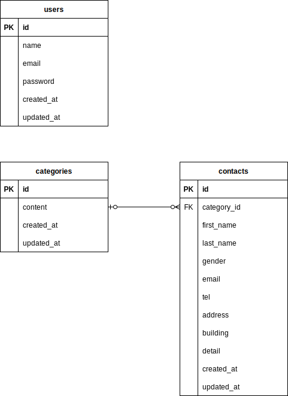
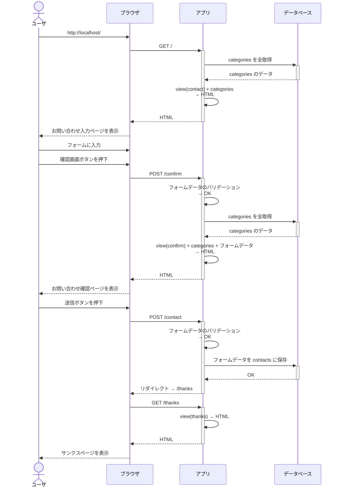
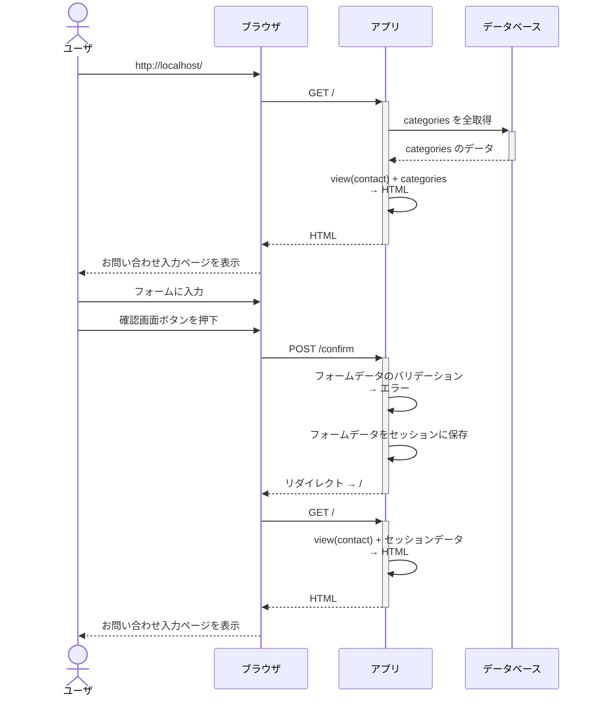
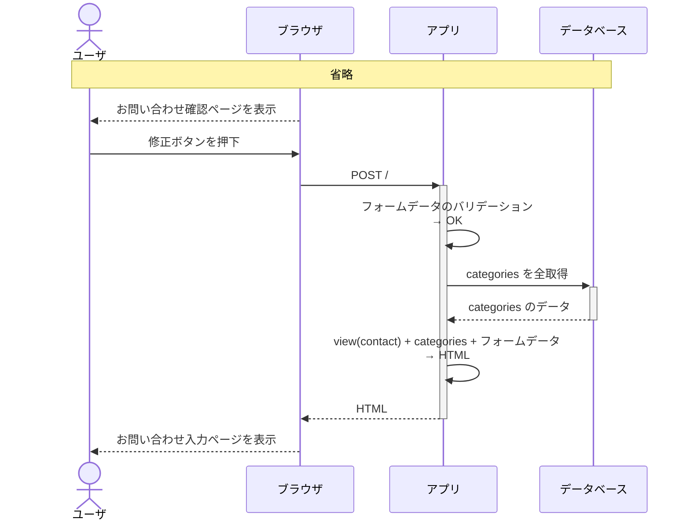
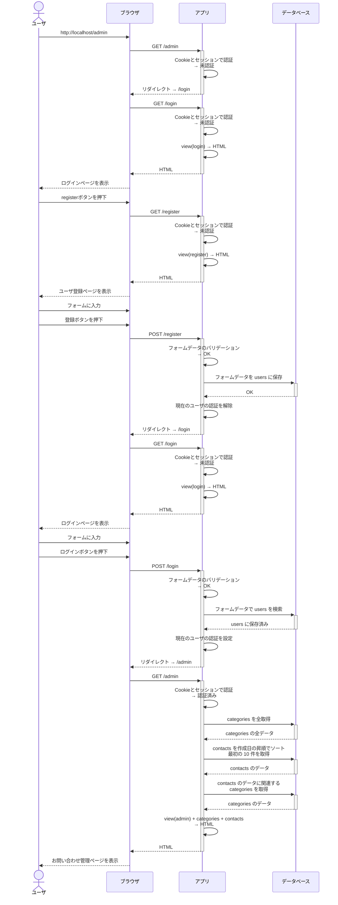
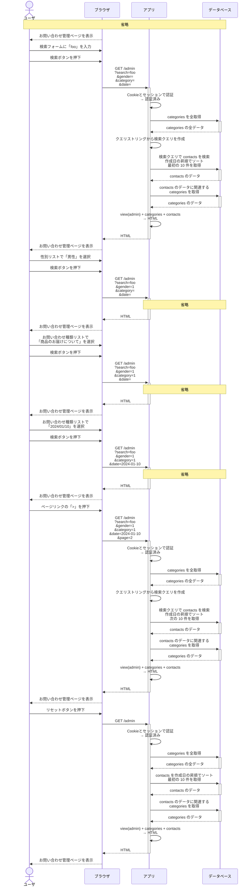
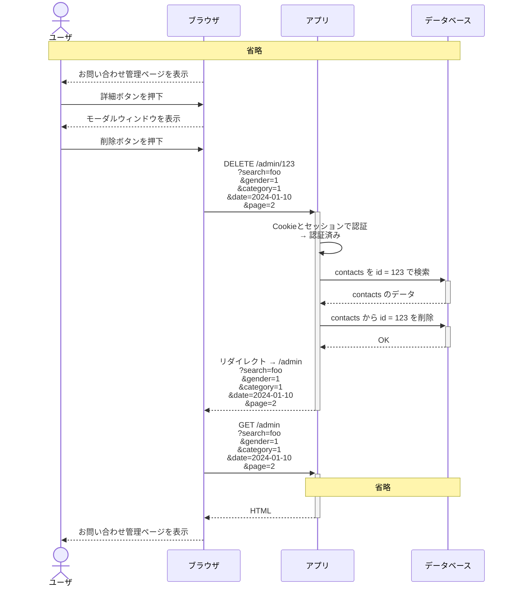
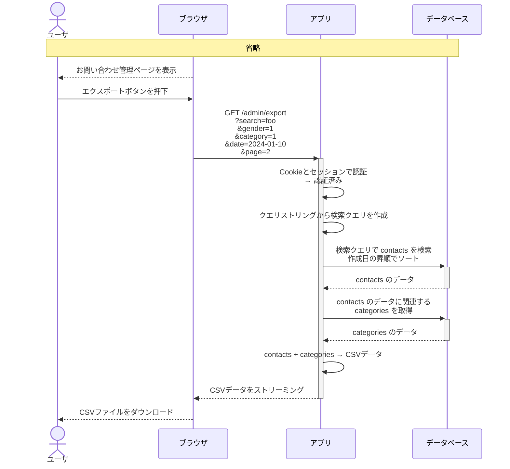

# お問い合わせフォーム

## 環境構築

### はじめに

このアプリでは localhost の 80 番と 8080 番を使用しますので、他で使用されていないことを確認してください。

開発および動作確認は MacOS 14 上で行いました。他の環境では動作確認していませんので、不具合があるかもしれませんがご了承ください。

### アプリ起動までの手順

1. このリポジトリの複製をローカルに作成してください。

```
$ git clone https://github.com/ryamao/ability-test.git
```

2. 作成したリポジトリ内で Docker コンテナを起動してください。

```
$ cd ability-test
$ docker compose up -d --build
```

3. Docker コンテナが起動したら php コンテナ内で `composer install` を実行してください。

```
$ docker compose exec php composer install
```

4. `src/.env.example` をコピーして `src/.env` を作成してください。

```
$ cp src/.env.example src/.env
```

5. 作成した `src/.env` の環境変数を変更してください。

```
...
- DB_HOST=127.0.0.1
+ DB_HOST=mysql
...
- DB_DATABASE=laravel
- DB_USERNAME=root
- DB_PASSWORD=
+ DB_DATABASE=laravel_db
+ DB_USERNAME=laravel_user
+ DB_PASSWORD=laravel_pass
...
```

6. 暗号化キーを生成してください。

```
$ docker compose exec php artisan key:generate
```

7. データベースの初期化を行ってください。

```
$ docker compose exec php artisan migrate --seed
```

8. 環境構築後、以下の URL からアクセス可能になります。

- お問い合わせフォームのトップページ
  - http://localhost/
- 管理者ユーザの登録ページ
  - http://localhost/register
- お問い合わせ管理ページ
  - http://localhost/admin
- phpMyAdmin
  - http://localhost:8080/

### テスト環境構築

PHPUnit を実行する場合は以下の手順が必要になります。

1. mysql コンテナ内で MySQL クライアントを起動してください。
   - ユーザ : `root`
   - パスワード : `root`

```
$ docker compose exec mysql mysql -u root -p
Enter password: root
```

2. MySQL ユーザを作成してください。
   - ユーザ : `test_user`
   - パスワード : `test_pass`

```
mysql> CREATE USER test_user IDENTIFIED BY 'test_pass';
```

3. データベースを作成し、新規ユーザに権限を付与してください。

```
mysql> CREATE DATABASE test_db;
mysql> GRANT ALL PRIVILEGES ON test_db.* TO test_user;
mysql> exit
```

4. テスト環境でマイグレーションを行ってください。

```
$ docker compose exec php artisan migrate --env=testing
```

5. テスト環境構築後、PHPUnit が実行可能になります。

```
$ docker compose exec php artisan test --testdox
```

## 使用技術

- PHP : 8.3.1
  - Laravel : 10.39.0
  - Laravel Fortify : 1.19.1
- MySQL : 8.0
- Nginx : 1.24

## ER図



## CRUD図

| ルートパス | メソッド | users | categories | contacts
| ------------------ | ------ | ---- | ---- | ---- |
| `/`                | GET    |      |  R   |      |
| `/`                | POST   |      |  R   |      |
| `/confirm`         | POST   |      |  R   |      |
| `/contact`         | POST   |      |  R   | C    |
| `/thanks`          | GET    |      |      |      |
| `/register`        | GET    |      |      |      |
| `/register`        | POST   | CR   |      |      |
| `/login`           | GET    |      |      |      |
| `/login`           | POST   |  R   |      |      |
| `/logout`          | POST   |      |      |      |
| `/admin`           | GET    |      |  R   |  R   |
| `/admin/{contact}` | DELETE |      |      |    D |
| `/admin/export`    | GET    |      |  R   |  R   |

## シーケンス図

### お問い合わせ入力（バリデーションエラーが発生しなかった場合）



### お問い合わせ入力（入力ページでバリデーションエラーが発生した場合）



### お問い合わせ入力（確認ページで修正ボタンを押した場合）



### ユーザ登録から管理ページ表示まで

1. 未認証の状態で http://localhost/admin にアクセスする。
2. ログインページにリダイレクトする。
3. ログインページからユーザ登録ページにアクセスする。
4. ユーザ登録ページでフォームに入力し登録ボタンを押す。
5. ログインページにリダイレクトする。
6. ログインページでフォームに入力しログインボタンを押す。
7. お問い合わせ管理ページが表示される。



### 管理ページでのお問い合わせの検索



### 管理ページでのお問い合わせの削除

この説明で削除するお問い合わせは contacts テーブルでの id が 123 であるとします。



### 管理ページでのお問い合わせのエクスポート



## URL

- 開発環境
  - お問い合わせフォーム入力ページ : http://localhost/
  - 管理者ユーザ登録ページ : http://localhost/register
  - 管理者ユーザログインページ : http://localhost/login
  - お問い合わせ管理ページ : http://localhost/admin
- phpMyAdmin : http://localhost:8080/

## 検索の仕様

お問い合わせ管理ページでの「名前・メールアドレス」検索について説明します。

- デフォルトでは入力文字列を使って部分一致で検索します。
- スペースで区切ることで複数語による絞り込み検索ができます。
- 文字列を `[` `]` で囲むと完全一致で検索します。
- 検索対象は「姓」「名」「メールアドレス」です。

例として以下のデータを使って説明します。

| 姓 | 名 | メールアドレス |
| --- | --- | --- |
| 山田 | 一郎 | test1@example.com |
| 三村 | 一 | test2@example.com |
| 田村 | 三郎 | test3@example.com |

### `一` で検索した場合

| 姓 | 名 | メールアドレス |
| --- | --- | --- |
| 山田 | 一郎 | test1@example.com |
| 三村 | 一 | test2@example.com |

デフォルトでは部分一致で検索します。

### `[一]` で検索した場合

| 姓 | 名 | メールアドレス |
| --- | --- | --- |
| 三村 | 一 | test2@example.com |

`[` `]` で囲むと完全一致で検索します。

### `一 test1` で検索した場合

| 姓 | 名 | メールアドレス |
| --- | --- | --- |
| 山田 | 一郎 | test1@example.com |

スペースで区切ると絞り込み検索します。

### `三` で検索した場合

| 姓 | 名 | メールアドレス |
| --- | --- | --- |
| 三村 | 一 | test2@example.com |
| 田村 | 三郎 | test3@example.com |

各カラムをそれぞれ検索し、結果の和集合を表示します。
