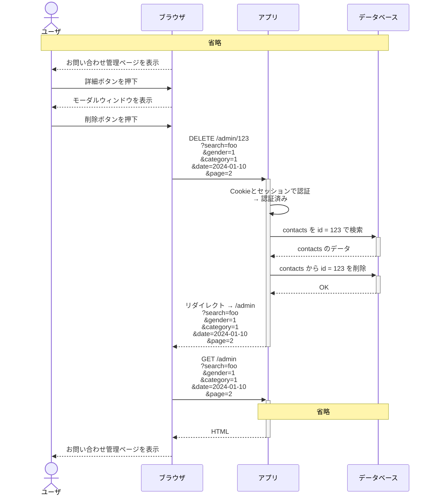

# シーケンス図

## お問い合わせ管理ページ

### お問い合わせの削除

この説明で削除するお問い合わせは contacts テーブルでの id が 123 であるとします。

```mermaid
sequenceDiagram
    actor       U as ユーザ
    participant B as ブラウザ
    participant A as アプリ
    participant D as データベース

    Note over U, D: 省略
    B -->>  U : お問い合わせ管理ページを表示

    U ->>   B : 詳細ボタンを押下
    B -->>  U : モーダルウィンドウを表示
    U ->>   B : 削除ボタンを押下
    B ->>+  A : DELETE /admin/123<br />?search=foo<br />&gender=1<br />&category=1<br />&date=2024-01-10<br />&page=2
    A ->>   A : Cookieとセッションで認証<br />→ 認証済み
    A ->>+  D : contacts を id = 123 で検索
    D -->>- A : contacts のデータ
    A ->>+  D : contacts から id = 123 を削除
    D -->>- A : OK
    A -->>- B : リダイレクト → /admin<br />?search=foo<br />&gender=1<br />&category=1<br />&date=2024-01-10<br />&page=2

    B ->>+  A : GET /admin<br />?search=foo<br />&gender=1<br />&category=1<br />&date=2024-01-10<br />&page=2
    Note over A, D: 省略
    A -->>- B : HTML
    B -->>  U : お問い合わせ管理ページを表示
```
