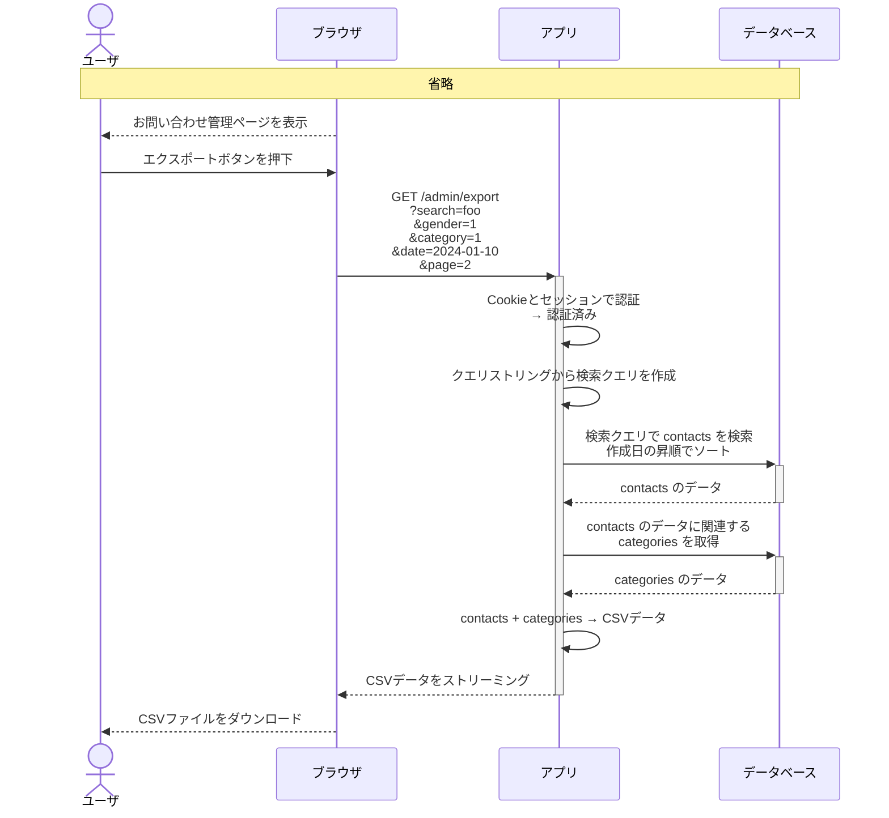

# シーケンス図

## お問い合わせ管理ページ

### お問い合わせのエクスポート

```mermaid
sequenceDiagram
    actor       U as ユーザ
    participant B as ブラウザ
    participant A as アプリ
    participant D as データベース

    Note over U, D: 省略
    B -->>  U : お問い合わせ管理ページを表示

    U ->>   B : エクスポートボタンを押下
    B ->>+  A : GET /admin/export<br />?search=foo<br />&gender=1<br />&category=1<br />&date=2024-01-10<br />&page=2
    A ->>   A : Cookieとセッションで認証<br />→ 認証済み
    A ->>   A : クエリストリングから検索クエリを作成
    A ->>+  D : 検索クエリで contacts を検索<br />作成日の昇順でソート
    D -->>- A : contacts のデータ
    A ->>+  D : contacts のデータに関連する<br />categories を取得
    D -->>- A : categories のデータ
    A ->>   A : contacts + categories → CSVデータ
    A -->>- B : CSVデータをストリーミング
    B -->>  U : CSVファイルをダウンロード
```
