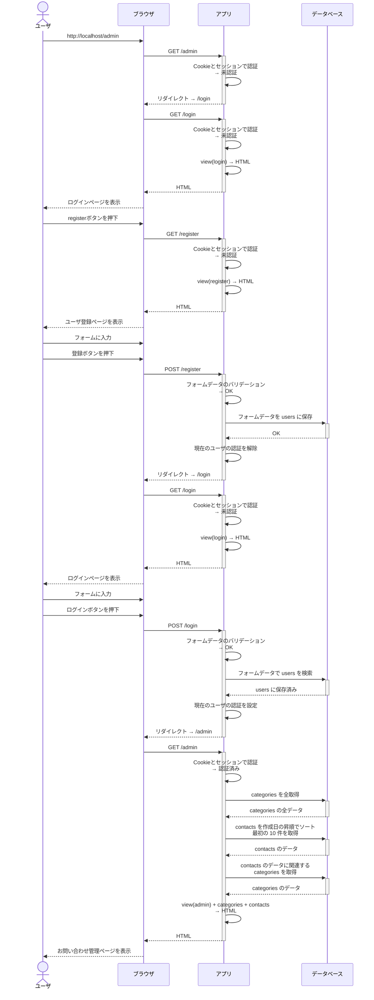

# シーケンス図

## お問い合わせ管理ページ

### ユーザ登録から管理ページ表示まで

1. 未認証の状態で http://localhost/admin にアクセスする。
2. ログインページにリダイレクトする。
3. ログインページからユーザ登録ページにアクセスする。
4. ユーザ登録ページでフォームに入力し登録ボタンを押す。
5. ログインページにリダイレクトする。
6. ログインページでフォームに入力しログインボタンを押す。
7. お問い合わせ管理ページが表示される。

