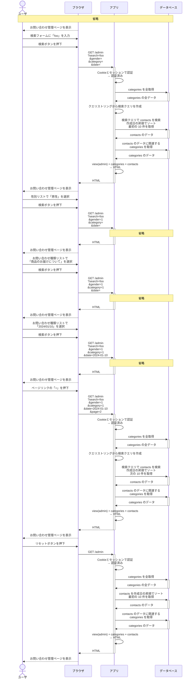

# シーケンス図

## お問い合わせ管理ページ

### お問い合わせの検索

```mermaid
sequenceDiagram
    actor       U as ユーザ
    participant B as ブラウザ
    participant A as アプリ
    participant D as データベース

    Note over U, D: 省略
    B -->>  U : お問い合わせ管理ページを表示

    U ->>   B : 検索フォームに「foo」を入力
    U ->>   B : 検索ボタンを押下
    B ->>+  A : GET /admin<br />?search=foo<br />&gender=<br />&category=<br />&date=
    A ->>   A : Cookieとセッションで認証<br />→ 認証済み
    A ->>+  D : categories を全取得
    D -->>- A : categories の全データ
    A ->>   A : クエリストリングから検索クエリを作成
    A ->>+  D : 検索クエリで contacts を検索<br />作成日の昇順でソート<br />最初の 10 件を取得
    D -->>- A : contacts のデータ
    A ->>+  D : contacts のデータに関連する<br />categories を取得
    D -->>- A : categories のデータ
    A ->>   A : view(admin) + categories + contacts<br />→ HTML
    A -->>- B : HTML
    B -->>  U : お問い合わせ管理ページを表示

    U ->>   B : 性別リストで「男性」を選択
    U ->>   B : 検索ボタンを押下
    B ->>+  A : GET /admin<br />?search=foo<br />&gender=1<br />&category=<br />&date=
    Note over A, D: 省略
    A -->>- B : HTML
    B -->>  U : お問い合わせ管理ページを表示

    U ->>   B : お問い合わせ種類リストで<br />「商品のお届けについて」を選択
    U ->>   B : 検索ボタンを押下
    B ->>+  A : GET /admin<br />?search=foo<br />&gender=1<br />&category=1<br />&date=
    Note over A, D: 省略
    A -->>- B : HTML
    B -->>  U : お問い合わせ管理ページを表示

    U ->>   B : お問い合わせ種類リストで<br />「2024/01/10」を選択
    U ->>   B : 検索ボタンを押下
    B ->>+  A : GET /admin<br />?search=foo<br />&gender=1<br />&category=1<br />&date=2024-01-10
    Note over A, D: 省略
    A -->>- B : HTML
    B -->>  U : お問い合わせ管理ページを表示

    U ->>   B : ページリンクの「>」を押下
    B ->>+  A : GET /admin<br />?search=foo<br />&gender=1<br />&category=1<br />&date=2024-01-10<br />&page=2
    A ->>   A : Cookieとセッションで認証<br />→ 認証済み
    A ->>+  D : categories を全取得
    D -->>- A : categories の全データ
    A ->>   A : クエリストリングから検索クエリを作成
    A ->>+  D : 検索クエリで contacts を検索<br />作成日の昇順でソート<br />次の 10 件を取得
    D -->>- A : contacts のデータ
    A ->>+  D : contacts のデータに関連する<br />categories を取得
    D -->>- A : categories のデータ
    A ->>   A : view(admin) + categories + contacts<br />→ HTML
    A -->>- B : HTML
    B -->>  U : お問い合わせ管理ページを表示

    U ->>   B : リセットボタンを押下
    B ->>+  A : GET /admin
    A ->>   A : Cookieとセッションで認証<br />→ 認証済み
    A ->>+  D : categories を全取得
    D -->>- A : categories の全データ
    A ->>+  D : contacts を作成日の昇順でソート<br />最初の 10 件を取得
    D -->>- A : contacts のデータ
    A ->>+  D : contacts のデータに関連する<br />categories を取得
    D -->>- A : categories のデータ
    A ->>   A : view(admin) + categories + contacts<br />→ HTML
    A -->>- B : HTML
    B -->>  U : お問い合わせ管理ページを表示
```
