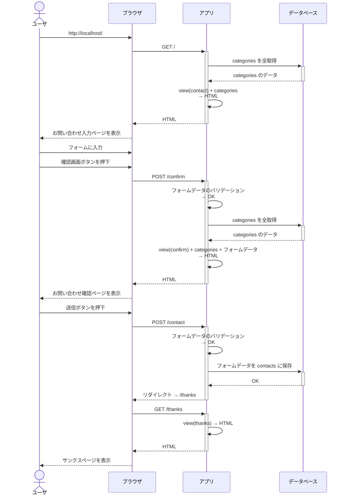

# シーケンス図

## お問い合わせ入力

### バリデーションエラーが発生しなかった場合

```mermaid
sequenceDiagram
    actor       U as ユーザ
    participant B as ブラウザ
    participant A as アプリ
    participant D as データベース

    U ->>   B : http://localhost/
    B ->>+  A : GET /
    A ->>+  D : categories を全取得
    D -->>- A : categories のデータ
    A ->>   A : view(contact) + categories<br />→ HTML
    A -->>- B : HTML
    B -->>  U : お問い合わせ入力ページを表示

    U ->>   B : フォームに入力
    U ->>   B : 確認画面ボタンを押下
    B ->>+  A : POST /confirm
    A ->>   A : フォームデータのバリデーション<br />→ OK
    A ->>+  D : categories を全取得
    D -->>- A : categories のデータ
    A ->>   A : view(confirm) + categories + フォームデータ<br />→ HTML
    A -->>- B : HTML
    B -->>  U : お問い合わせ確認ページを表示

    U ->>   B : 送信ボタンを押下
    B ->>+  A : POST /contact
    A ->>   A : フォームデータのバリデーション<br />→ OK
    A ->>+  D : フォームデータを contacts に保存
    D -->>- A : OK
    A -->>- B : リダイレクト → /thanks

    B ->>+  A : GET /thanks
    A ->>   A : view(thanks) → HTML
    A -->>- B : HTML
    B -->>  U : サンクスページを表示
```
