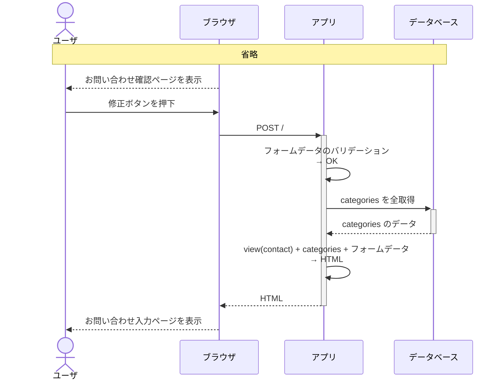

# シーケンス図

## お問い合わせ入力

### 確認ページで修正ボタンを押した場合

```mermaid
sequenceDiagram
    actor       U as ユーザ
    participant B as ブラウザ
    participant A as アプリ
    participant D as データベース

    Note over U, D: 省略
    B -->>  U : お問い合わせ確認ページを表示

    U ->>   B : 修正ボタンを押下
    B ->>+  A : POST /
    A ->>   A : フォームデータのバリデーション<br />→ OK
    A ->>+  D : categories を全取得
    D -->>- A : categories のデータ
    A ->>   A : view(contact) + categories + フォームデータ<br />→ HTML
    A -->>- B : HTML
    B -->>  U : お問い合わせ入力ページを表示
```
